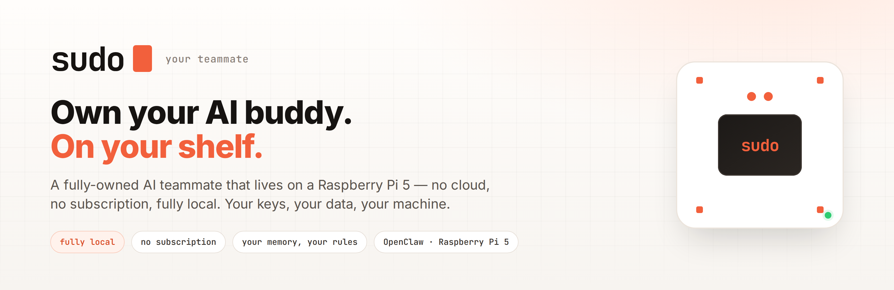
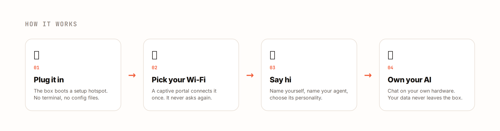

<div align="center">
  
</div>

<div align="center">

**A fully-owned AI teammate that lives on a Raspberry Pi 5.**
Local by default. No subscription. Your keys, your data, your machine.

[Website](https://sudospace.tech) · [Instagram](https://instagram.com/sudospace.tech) · [Early access](https://sudospace.tech)


</div>

---

## What is this?

`sudo` is a physical AI teammate that lives on a Raspberry Pi on your shelf — **OpenClaw, without the maintenance tax**. Self-hosting an AI agent normally means cryptic configs, broken dependencies, and constant updates. `sudo` packages all of that into a plug-and-play box: buy it, plug it in, name it, talk to it.

> **Ownership without the CS degree.**

Everyone will be able to *use* an agent. The durable value is *owning* one — your keys, your data, your machine, your model choice. `sudo` makes that as easy as the cloud incumbents — and it's yours, whether you run a local model or plug in a cloud one.

<div align="center">
  
</div>

---

## Features

- 🏠 **Local by default** — the agent runs on your box, and your memory lives on-device.
- 🔒 **Private by default** — your memory, your rules.
- 💳 **No subscription required** — buy the box, own the agent.
- 🧠 **Your choice of model** — run a local model offline, or connect a cloud model *only if you want*.
- 🤖 **Multi-bot** — several agents in one chat.
- 📊 **Local dashboards** — the private apps your agent can run.
- 💬 **Real connectors** — WhatsApp, email, and text, out of the box.
- ⚙️ **One-tap updates** — you decide when, and what stays.

---

## How it works

1. **Plug it in** — the box boots a setup hotspot. No terminal, no config files.
2. **Pick your Wi-Fi** — a captive portal connects it once. It never asks again.
3. **Say hi** — name yourself, name your agent, choose its personality.
4. **Own your AI** — chat on your own hardware. Your memory stays on the box; connect a cloud model only if you want to.

> "This is when it stops feeling like a tool and starts feeling like a teammate."
>
> "Full ownership unlocks freedom. Imagination becomes the limit."

---

## Repository layout

```
raspi-factory/        Factory image builder + on-device runtime
├── sudo-dashboard/   On-device web dashboard (Python, no build step)
├── sudo-pi/          First-boot installers + configurators
├── wifi-setup/       Captive-portal Wi-Fi onboarding
├── openclaw/         OpenClaw base config + sudo plugins
├── picoclaw/         Fallback engine (until OpenClaw installs)
└── whatsapp-bridge/  WhatsApp connector
design/               Design references
assets/               README visuals
```

**The agent brain is [OpenClaw](https://openclaw.ai).** On first boot the device installs OpenClaw (prebuilt arm64 bundle on the card, or npm) and hands over to it. PicoClaw ships on the card only as a fallback, so the box is never talking to nothing while OpenClaw installs.

---

## Status

🚧 **Active development — early access.** 9 beta testers running it now; piloting with schools. Get in touch via [sudospace.tech](https://sudospace.tech) or [@sudospace.tech](https://instagram.com/sudospace.tech).

---

<div align="center">
<sub>Two continents, one small purple guy.</sub>
</div>
